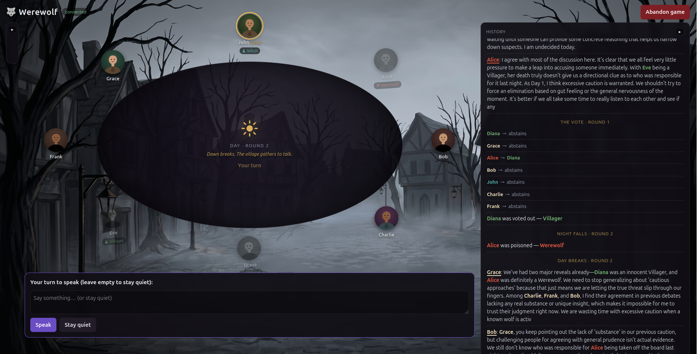
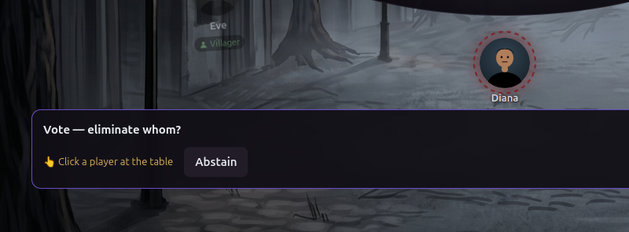
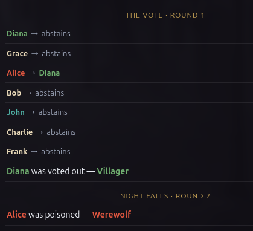
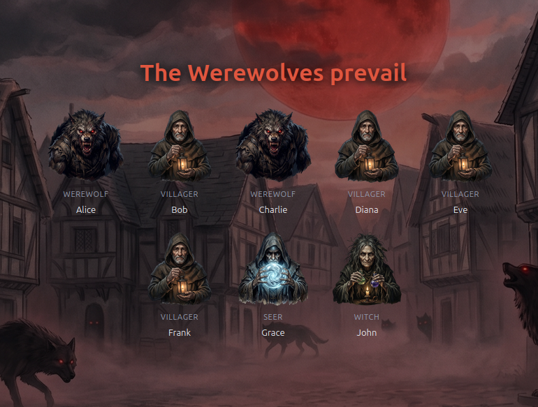

<h1 align="center">🐺 Werewolf, Played by AI</h1>

<p align="center">
  <em>A solo game of <strong>The Werewolves of Miller's Hollow</strong> where you are the only human at the table —
  every other villager is a local LLM that talks, lies, deduces, and plays to win.</em>
</p>

<p align="center">
  
</p>

---

## What is this?

You sit down in a fog-bound village. Some of your neighbours are werewolves. Each night they kill;
each day everyone argues and lynches a suspect. Find the wolves before they outnumber you.

The twist: **the other players are AI.** Every NPC is driven by a local model through
[Ollama](https://ollama.com), each with its own private memory, reasoning, and agenda. They are *not*
scripted — they're handed the rules, what they can legitimately see, and a single goal (**win**), then
left to play. They bluff, they accuse, they defend their packmates, they waste their potions, they
occasionally out themselves. No two games play the same.

Roles in the box: **Villager · Werewolf · Seer · Witch.**

## What makes it tick

The other players aren't scripted. Each NPC gets the rules, its own private notes, and a single goal — win — and a local model works out the rest: what to say, who to trust, when to lie, how to vote. Every seat runs the same code, so whatever strategy turns up is the model's own.

Hidden information is enforced where it counts. The server only ever sends a player what their role is allowed to know, so a living player's role never reaches the browser; there's nothing to dig out of the network tab.

And it's meant to feel like a game rather than a dashboard. Players sit around a candlelit table through a day/night cycle, hand-drawn townsfolk over AI-painted backdrops, with the log colour-coded and the current speaker underlined. Since turns stream in live, you actually watch the wolves confer, the Seer investigate, and each villager weigh a vote before it lands.

<table>
  <tr>
    <td width="50%"></td>
    <td width="50%"></td>
  </tr>
  <tr>
    <td align="center"><sub>Click a neighbour to vote — or abstain.</sub></td>
    <td align="center"><sub>Every name is bold; the dead reveal their true colours.</sub></td>
  </tr>
</table>

<p align="center">
  
  <br><sub>Game over reveals the whole table.</sub>
</p>

## How a round flows

1. **Night** 🌙 — the werewolves choose a victim, the Seer investigates one player, the Witch may heal or poison.
2. **Day** ☀️ — survivors debate over one or more rounds (you can speak or stay quiet).
3. **Vote** ⚖️ — the village lynches a suspect (ties go to a runoff). Eliminated players have their role revealed.
4. Repeat until one team is wiped out.

## Tech stack

A pnpm monorepo, TypeScript end to end, Zod schemas as the single source of truth.

| Layer | Stack |
|---|---|
| **Game engine** (`server/src/game`) | Pure, immutable, deterministic (injectable RNG). No I/O. |
| **NPC brain** (`server/src/npc`) | Per-player view + prompt → Ollama with **grammar-constrained JSON** → validated action. Private reasoning + rewritable memory each turn. |
| **API** (`server/src/api`) | Express + **Server-Sent Events** (no WebSockets needed for one player) + plain HTTP for your answers. One in-memory session. |
| **Web UI** (`client`) | React + Vite + **Framer Motion**. Procedural SVG characters, AI-generated backdrops/role cards, full `prefers-reduced-motion` support. |
| **LLM** | [Ollama](https://ollama.com) locally — default `gemma4:e4b` (any format-friendly model works; `phi4`, `qwen2.5` are good too). |

The slow, turn-by-turn cadence of a local model is treated as a feature: each NPC turn announces *who is acting*
before its (multi-second) think, then reveals the result — anticipation, then payoff.

## Getting started

**Prerequisites:** [Node](https://nodejs.org) + [pnpm](https://pnpm.io), and [Ollama](https://ollama.com) running locally.

```bash
# 1. Pull a model (once)
ollama pull gemma4:e4b

# 2. Install
pnpm install

# 3. Run the server (connects to Ollama, serves the game API on :3000)
pnpm dev:server

# 4. In another terminal, run the web client (Vite on :5173)
pnpm dev:client
```

Open **http://localhost:5173**, pick a preset, and take your seat.

> The web UI ships with AI-generated art in `client/public/images/`. If those files are absent the game
> falls back to its built-in gradients and SVG icons — it always runs.

### Other ways to play

```bash
pnpm --filter server launch   # interactive terminal launcher (play / watch / testing)
pnpm --filter server npc      # watch an all-AI game in the terminal
pnpm --filter server web      # headless client that drives a full game over the API
```

### Developing

```bash
pnpm typecheck                # both packages
pnpm --filter server test     # the engine + NPC + API test suite (vitest)
```

## Project layout

```
server/
  src/game/    pure engine: phases, night/day resolution, votes, win conditions
  src/npc/     LLM controller, per-player hidden-info view, prompts, output schemas
  src/api/     Express + SSE session, the wire protocol, the web-human controller
  src/ollama/  structured-output Ollama client
  src/cli/     terminal runners (launch / npc / play) and rendering
client/
  src/         React board: table, seats, animations, action bar, history, finale
  public/images/  AI-generated backdrops, role cards, and finale scenes
```

## Design principles

- **Don't script the AI.** Prompts give facts, the rules, and the goal — never "do X." Forcing moves makes every NPC identical and kills the bluffing.
- **The hidden-information boundary is sacred.** Enforced on the server (`buildPlayerView`) and preserved all the way into the art — a living player's role is never sent to the client.
- **KISS / SRP / DRY**, everything typed from Zod, no overengineering.

## Credits

A personal experiment — vibe-coded in maybe ten hours. Character and scene art generated with
**Nano Banana (Gemini)**. Inspired by *The Werewolves of Miller's Hollow*.
